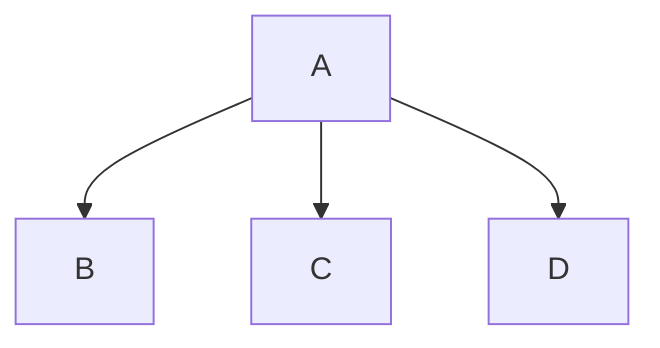

# 标题 1

## 标题 2

---

_斜体文本_
**粗体文斜本**
**_粗斜体文本_**
~~删除线~~
<u>带下划线文本</u>
==标记==
**H~2~O**
**2^n^**

---



---

创建脚注格式类似这样 [^runoob]。
[^runoob]: 菜鸟教程

---

- 列表 1

* 列表 2

- 列表 3

1. 列表
2. 列表
3. 列表

- [x] 任务列表

---

> 区块引用 1
>
> > 区块引用 2
> > `代码` 函数
> >
> > ```javascript
> > $(document).ready(function () {
> >   alert("RUNOOB");
> > });
> > ```

`带行号代码` 函数

```javascript{.line-numbers}
$(document).ready(function () {
  alert("RUNOOB");
});
```

行内代码`alert('RUNOOB');`

---

这是一个链接 [菜鸟教程](https://www.runoob.com)
<https://www.runoob.com>

---


这个链接用 1 作为网址变量 [RUNOOB][1].
然后在文档的结尾为变量赋值

[1]: http://static.runoob.com/images/runoob-logo.png

---

| 左对齐 | 右对齐 | 居中对齐 |
| :----- | -----: | :------: |
| 单元格 | 单元格 |  单元格  |
| 单元格 | 单元格 |  单元格  |

---

使用 <kbd>Ctrl</kbd>+<kbd>Alt</kbd>+<kbd>Delete</kbd>重启电脑

