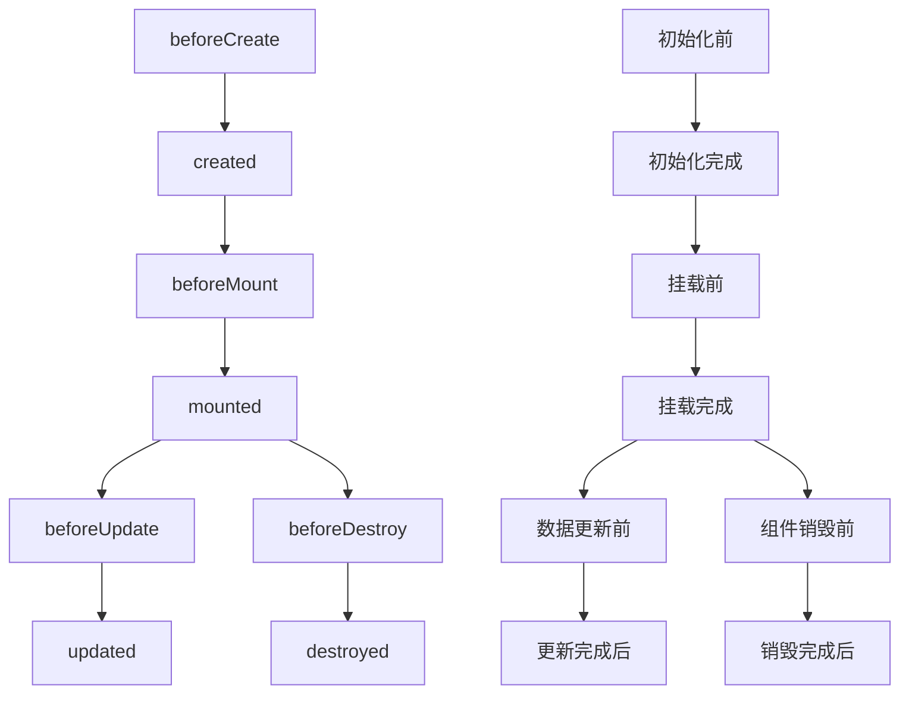

### Vue 框架

### 目录

[TOC]

#### Vue 的引用

```html
<script src="https://cdn.jsdelivr.net/npm/vue/dist/vue.js"></script>
```

#### Vue 生命周期

##### 生命周期函数



- **`created()` 和 `activated()`的区别**

  > **`created()`** **第一次加载时只触发一次**
  >
  > **`activated()` 每次进入页面都触发**

#### Vue 项目目录结构


| 名称             | 作用                           |
| ---------------- | ------------------------------ |
| **build**        | **存放项目构建脚本**           |
| **config**       | **存放项目的一些基本配置信息** |
| **node_modules** | **存放项目的所有依赖**         |
| **src**          | **项目的源码**                 |
| **static**       | **静态资源**                   |
| **index.html**   | **项目的首页，入口页**         |
| **package.json** | **定义项目的所有依赖**         |

#### Vue 构造器

```html
<div id="id">
  <h1>{{name}}</h1><!--你好-->
  <h1>{{age}}</h1><!--20-->
  <h1>{{name()}}</h1><!--Hello Vue-->
  <h1>{{str.name}}</h1><!--Vue-->
  <h1>{{str.age}}</h1><!--10-->
</div>
```

```javascript
var vue = new Vue({
  el: "#id", //选择器
  data: {
    //定义属性
    name: "你好",
    age: 20,
    str: {
      //定义对象
      name: "Vue",
      age: 10,
    },
  },
  methods: {
    //定义函数
    name: function () {
      return "Hello Vue";
    },
  },
});
```

[返回顶部](#目录)

#### Vue 指令

##### **v-text 和 v-html**

> **文本渲染**

```html
<div id="app">
    <div v-html="msg"></div>
    <div v-text="msg"></div>
</div>
<script>
	new Vue({
	  el: '#app',
	  data: {
	    msg: '<h1>菜鸟教程</h1>'
	  }
	})
</script>
```

##### **v-bind**

> **属性绑定**

```html
<div v-bind:属性名=“” ></div>
<div :属性名=“” ></di>
```

##### v-model

> **双向数据绑定**

```html
<div id="app">
    <p>{{ msg }}</p>
    <input v-model="msg">
</div>
<script>
	new Vue({
	  el: '#app',
	  data: {
	    msg: 'Runoob!'
	  }
	}
</script>
```

[返回顶部](#目录)

##### **v-for**

> **循环语句**

```html
<div id="app">
  <ul>
    <li v-for="item in sites">
      <li>{{ item.name }}</li>
    </li>
  </ul>
</div>
<script>
new Vue({
  el: '#app',
  data: {
    sites: [
      { name: 'Runoob' },
      { name: 'Google' },
      { name: 'Taobao' }
    ]
  }
})
</script>
```

##### **v-if 和 v-else**

> **条件语句**

```html
<div id="app">
	<div v-if="flag">
	  flag 为 true
	</div>
	<div v-else>
	  flag 为 false
	</div>
</div>
```

##### **v-if 和 v-show 的区别**

> **v-if = "false" 从页面中移除该元素**
>
> **v-show = "false" 隐藏该元素(不移除)**

##### **v-on**

> **事件绑定**

```html
<div v-on:事件名=“” ></div>
<div @事件名=“” ></di>
```

> ###### 事件修饰符

- **`.stop`			阻止冒泡**
- **`.prevent`      阻止默认事件**
- **`.capture`      阻止捕获**
- **`.self`            只监听触发该元素的事件**
- **`.once`            只触发一次**
- **`.left`            左键事件**
- **`.right`          右键事件**
- **`.middle`        中间滚轮事件**

[返回顶部](#目录)

#### Vue事件

- 鼠标事件

  | 事件名          | 作用     |
  | --------------- | -------- |
  | **@click**      | **单击** |
  | **@mousedown**  | **按下** |
  | **@mouseup**    | **抬起** |
  | **@dblclick**   | **双击** |
  | **@mousemove**  | **移动** |
  | **@mouseleave** | **离开** |
  | **@mouseout**   | **移出** |
  | **@mouseenter** | **进入** |

#### 监听属性

- **侦听器 `watch`**

  ```html
  <div id = "app">
  	千米 :<input type = "text" v-model = "km">
  	米 :<input type = "text" v-model = "m">
  </div>
  <script type = "text/javascript">
  	var vm = new Vue({
      	el: '#app',
          data: {
             km : 0,
             m:0
          },		
          //侦听器
    		watch : {
    		   km:function(val) {
    		      this.km = val;
    		      this.m = this.km * 1000
    		   },
    		   m : function (val) {
    		      this.km = val / 1000;
    		      this.m = val;
    		   }
    		}
      });
  </script>
  ```

[返回顶部](#目录)

#### 组件

##### 全局组件

> Vue.**==component== ( '==组件名==' ,  {  //自定义组件  })**

```html
<div id="app">
	<runoob></runoob>
</div>
<script>
	// 注册全局组件
	Vue.component('runoob', {
		template: '<h1>自定义组件!</h1>'
	})
	// 创建根实例
	new Vue({
	  	el: '#app'
	})
</script>
```

##### 局部组件

```html
<div id="app">
	<runoob></runoob>
</div>
<script>
	var Child = {
	  	template: '<h1>自定义组件!</h1>'
	}
	// 创建根实例
	new Vue({
	  	el: '#app',
        // 注册局部组件
	  	components: {
	    	// 只在父模板可用
	    	'runoob': Child
	  	}
	})
</script>
```

[返回顶部](#目录)

#### 组件之间传值

##### 子传父

- **子组件**

  ```html
  <template>
    <div>
      <button @click="submit">子传父</button>
    </div>
  </template>
  <script>
    export default{
      data(){
        return{ 
          value: "value"
        }
      },
      methods:{
        submit(){
          //通过 $emit 向父组件传 value 值
          this.$emit('Parent', this.value);
        }
      }
    }
  </script>
  ```

- **父组件**

  ```html
  <template>
    <div>
      <!-- 通过 自定义事件 接收子组件的 value 值 -->
      <子组件 @Parent="getValue"></子组件>
    </div>
  </template>
  <script>
    import 子组件 from '/子组件'
    export default{
      data(){
        return{
          value: ""
        }
      },
      components:{
        子组件
      },
      methods:{
        //自定义事件名
        getValue(value){
          this.value = value;
        }
      }
    }
  </script>
  ```

##### 父传子

- **父组件**

  ```html
  <template>
    <div>
      <!-- 通过 自定义属性 向子组件传值 -->
      <子组件 :child="childValue"></子组件>
    </div>
  </template>
  <script>
    import 子组件 from '/子组件'
    export default{
      data(){
        return{
          childValue: "value"
        }
      },
      components:{
        子组件
      }
    }
  </script>
  ```

- **子组件**

  ```html
  <template>
    <div>
      <span>{{ child }}</span>
    </div>
  </template>
  <script>
    export default{
      //通过 props 接收父组件的值
      props: ['child']
    }
  </script>
  ```

##### 兄弟组件传值

- **父组件**

  ```html
  <template>
    <div id="app">
      <A></A>
      <B></B>
    </div>
  </template>
  <script>
    import A from './a.vue'
    import B from './b.vue'
    export default {
      components:{
        A, B
      }
    }
  </script>
  ```

- **A 组件**

  ```html
  <template>
    <div id="app">
      <button @click="aValue">A按钮</button>
    </div>
  </template>
  <script>
    import eventVue from './event.js'
    export default {
      data() {
        return {
          msgA: "组件A"
        }
      },
      methods: {
        aValue() {
          //$emit 方法会触发一个事件
          eventVue.$emit("myFun", this.msgA);
        }
      }
    }
  </script>
  ```

- **B 组件**

  ```html
  <template>
    <div id="app">
      <div>{{ msgB }}</div>
    </div>
  </template>
  <script>
    import eventVue from './event.js'
    export default {
      data() {
        return {
          msgB: "组件B"
        }
      },
      created(){
        this.bValue();
      },
      methods: {
        bValue() {
          //$on 接收A组件传的值
          eventVue.$on("myFun", (msg) => { 
            this.msgB = msg
          })
        }
      }
    }
  </script>
  ```

- **`event.js`**

  ```js
  import Vue from 'vue'
  
  export default new Vue
  ```

#### 数据缓存

**`sessionStorage` : 浏览器关闭时自动删除**

**`localStorage`: 永久保存,手动删除**

- **写入缓存**

  ```js
  localStorage.setItem('key值', value);
  sessionStorage.setItem('key值', value);
  ```
  
- **输出缓存**

  ```js
  localStorage.getItem('key值');
  sessionStorage.getItem('key值');
  ```
  
- **删除缓存**

  ```js
  localStorage.removeItem('key值');
  localStorage.clear(); //清空所有缓存
  sessionStorage.removeItem('key值');
  sessionStorage.clear(); //清空所有缓存
  ```

#### 网络请求

- **axios 引用**

  ```html
  <script src="https://unpkg.com/axios/dist/axios.min.js"></script>
  ```

> **请求方法**

```javascript
axios({
  	method: '请求方式',
  	url: '请求地址',
    headers: {},//请求头
  	data: {
  	  	//请求参数
		key: value
  	}
}).then(function (res) {})//请求成功
.catch(function (error) {});//请求失败
```

#### js-cookie

- **写入`cookie`**

  ```js
  this.$cookie.set('key', value);
  this.$cookie.set('key', value, {
      expires: date,	//有效期,单位:天
      path: '/src',	//路径
      domain: '域名'   //指定域名
  });
  ```

- **获取`cookie`**

  ```js
  this.$cookie.get('key');
  ```

- **删除`cookie`**

  ```js
  this.$cookie.remove('key');
  ```

#### Vuex 状态管理工具

1. **安装 vuex 依赖包**

   ```shell
   npm install vuex --save
   ```

2. **导入 vuex 包**

   ```javascript
   import Vuex from 'vuex'
   Vue.use(Vuex)
   ```

3. **创建 store 对象**

   ```javascript
   const store = new Vuex.Store({})
   ```

##### State

- 定义了应用状态的数据结构，可以在这里设置默认的初始状态

##### Getter

- 允许组件从 Store 中获取数据

##### Mutation

- 是唯一更改 store 中状态的方法，必须是同步函数。

##### Action

- 用于提交 mutation，不是直接变更状态，可以包含任意异步操作。

##### Module

- 可以将 store 分割成模块

> **State仓库**

```javascript
const store = new Vuex.Store({
    state:{
        conut: 0
    },
    //getters 是 store 的计算属性
    getters:{
    	newCount:state => state.count += 2
   	},
    //修改仓库状态
    mutations:{
        number(state，value){
            state.count += value;
        }
    }
})
```
> **组件**

```html
<div id='app'>
	<h1>{{ $store.state.count }}</h1>
</div>
```

```javascript
export default {
    computed: {
        //获取 newCount
		newCount(){
			return this.$store.getters.newCount;
		}
  	}，
    methods: {
		getVal() {
     		//通过 commit 提交一个名为 number 的 value
     		this.$store.commit("number", value);
   		}
 	}
}; 
```

> **mapState**